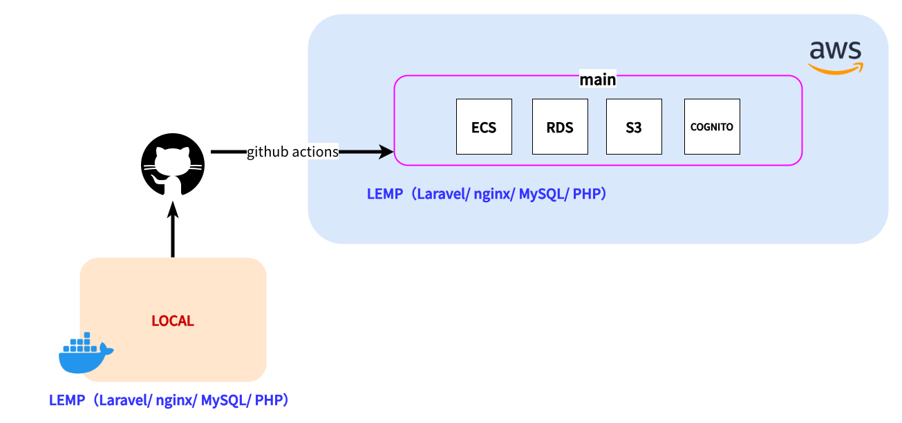

# パワスポ！ (Power Spot App)

⛩️ パワースポット検索・レビューアプリ
Laravel + Vue3 + Docker + AWS Cognito で構築しています。

## 🌐 本番環境URL

**https://d36zl5dyglu0w5.cloudfront.net**

## 📱 アプリケーション概要

「パワスポ！」は、神社・寺院などのパワースポットを検索・レビューできるWebアプリケーションです。

### 主な機能

- **🗺️ パワースポット検索**
  - Google Mapsと連携した地図上でのスポット検索
  - 地図の中心からの距離順でのソート機能

- **📝 レビュー機能**
  - スポットへのレビュー投稿
  - 写真付きレビューの投稿
  - スパム対策機能（過度な記号・絵文字の検出）

- **⭐ お気に入り・訪問済み機能**
  - お気に入りスポットの登録
  - 訪問済みスポットの記録
  - マイページでの一覧表示

- **📸 画像管理機能**
  - おみくじ画像のアップロード・管理
  - 御朱印画像のアップロード・管理
  - 画像の拡大表示・スライド表示

- **👤 マイページ**
  - 訪問済みスポット数・お気に入り数・レビュー数の統計表示
  - 投稿したレビューの一覧表示
  - アップロードしたおみくじ・御朱印画像の管理

- **🔐 認証機能**
  - AWS Cognitoによるユーザー認証
  - メールアドレス・パスワードでの登録・ログイン

## 技術スタック
- Backend: Laravel 12 (PHP 8.2)
- Frontend: Vue 3 + Vite + TailwindCSS
- Auth: AWS Cognito (Amplify)
- Infra: Docker (nginx, php-fpm, MySQL)

## AWS インフラ構成

本アプリケーションは AWS 上で動作しています。

### 使用している AWS サービス

- **ECS (Elastic Container Service)**: コンテナオーケストレーション
  - Fargate を使用したサーバーレスコンテナ実行
  - クラスター: `powerspot-cluster`
  - サービス: `powerspot-task-service-6vmrnfgi`
- **ECR (Elastic Container Registry)**: Docker イメージの保存
  - `powerspot/php`: PHP-FPM コンテナ
  - `powerspot/nginx`: Nginx コンテナ
- **RDS (Relational Database Service)**: MySQL データベース
  - インスタンスタイプ: `db.t4g.micro`
- **S3 (Simple Storage Service)**: 画像ファイルの保存
- **ALB (Application Load Balancer)**: ロードバランサー
- **CloudFront**: CDN と HTTPS 対応
- **Cognito**: ユーザー認証
  - User Pool を使用した認証機能

### インフラ構成図

